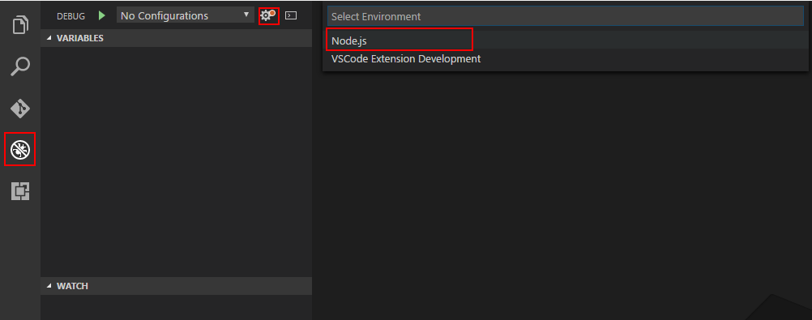
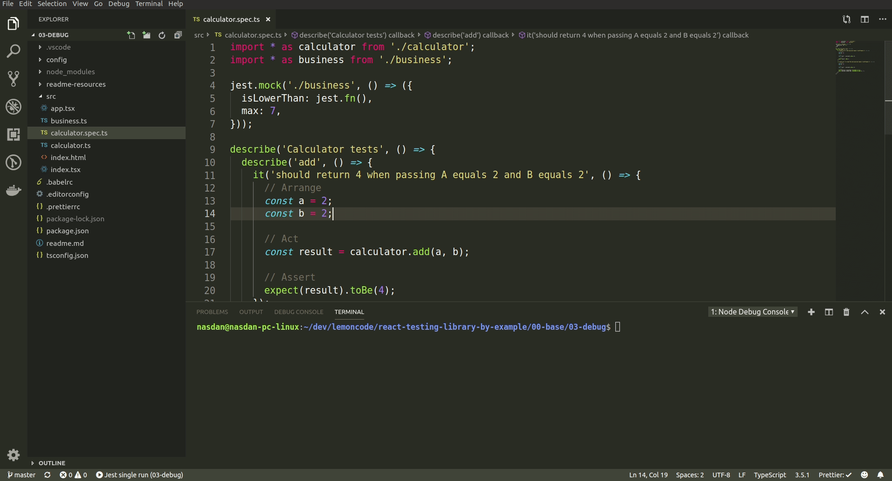

# 03 Debug

In this example we are going to configure VS Code for debugging Jest specs.

We will start from `02-calculator`.

Summary steps:

- Adding `launch.json` in VS Code.
- Update `launch.json` to work with Jest.

# Steps to build it

- `npm install` to install previous sample packages:

```bash
npm install
```

## Debugging Jest

Jest is running over node, so we could use VS Code for debugging jest specs:

### Using VS Code

As we know, VS Code provides by default a [node debugger](https://code.visualstudio.com/Docs/editor/debugging):

- Adding debug `launch.json` in VS Code:



> IMPORTANT: `.vscode/launch.json` file is created on root path.

- Configuring launch.json to single and watchAll runs:

### ./.vscode/launch.json

```json
{
  "version": "0.2.0",
  "configurations": [
    {
      "type": "node",
      "request": "launch",
      "name": "Jest single run",
      "program": "${workspaceRoot}/node_modules/jest/bin/jest.js",
      "args": [
        "-c",
        "./config/test/jest.json",
        "--verbose",
        "-i",
        "--no-cache"
      ],
      "console": "integratedTerminal",
      "internalConsoleOptions": "neverOpen"
    }
  ]
}
```

- Now we could run specs in debugging mode.



- We can add the `watch` mode configuration too. It's like previous configuration but adding the `--watchAll` flag:

### ./.vscode/launch.json

```diff
{
  "version": "0.2.0",
  "configurations": [
    {
      ...
-   }
+   },
+   {
+     "type": "node",
+     "request": "launch",
+     "name": "Jest watch run",
+     "program": "${workspaceRoot}/node_modules/jest/bin/jest.js",
+     "args": [
+       "-c",
+       "./config/test/jest.json",
+       "--verbose",
+       "-i",
+       "--no-cache",
+       "--watchAll"
+     ],
+     "console": "integratedTerminal",
+     "internalConsoleOptions": "neverOpen"
+   }
  ]
}

```

- Add config to run only selected file:

### ./.vscode/launch.json

```diff
{
  "version": "0.2.0",
  "configurations": [
    {
      ...
-   }
+   },
+   {
+     "type": "node",
+     "request": "launch",
+     "name": "Jest selected file",
+     "program": "${workspaceRoot}/node_modules/jest/bin/jest.js",
+     "args": [
+       "${fileBasenameNoExtension}",
+       "-c",
+       "./config/test/jest.json",
+       "--verbose",
+       "-i",
+       "--no-cache",
+       "--watchAll"
+     ],
+     "console": "integratedTerminal",
+     "internalConsoleOptions": "neverOpen"
+   }
  ]
}

```


- If you want more info about configure it, check this [post](https://www.basefactor.com/using-visual-studio-code-to-debug-jest-based-unit-tests)

# About Basefactor + Lemoncode

We are an innovating team of Javascript experts, passionate about turning your ideas into robust products.

[Basefactor, consultancy by Lemoncode](http://www.basefactor.com) provides consultancy and coaching services.

[Lemoncode](http://lemoncode.net/services/en/#en-home) provides training services.

For the LATAM/Spanish audience we are running an Online Front End Master degree, more info: http://lemoncode.net/master-frontend
